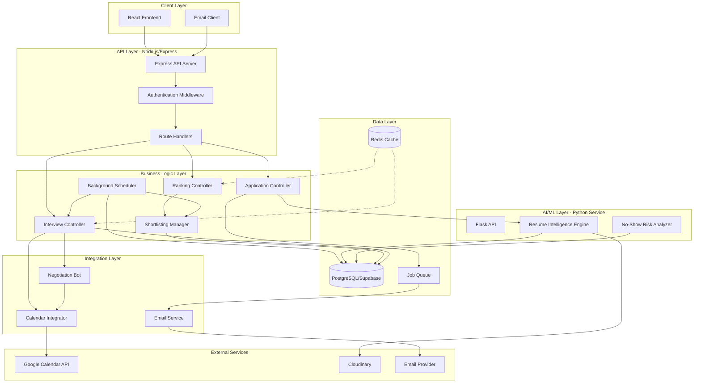
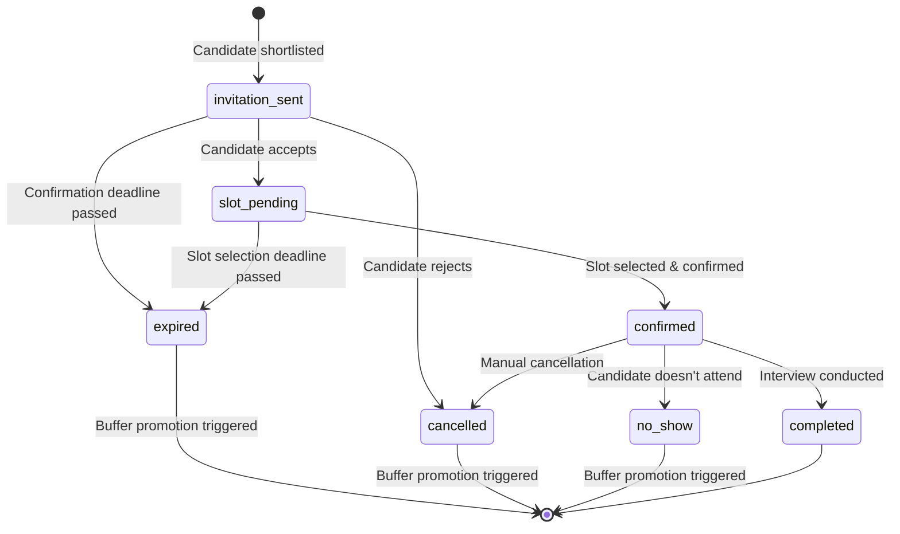
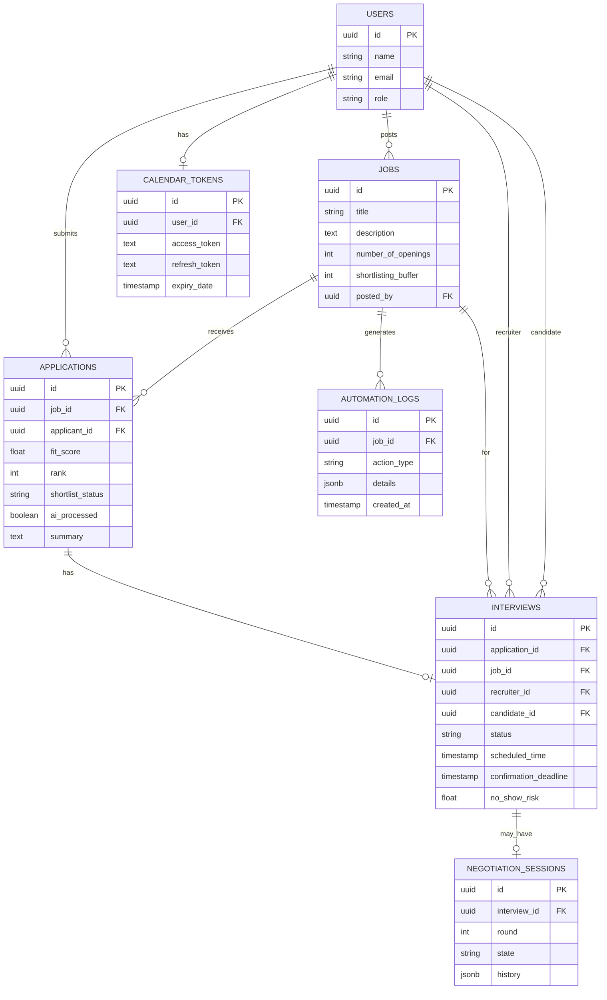

# Design Document: AI Hiring Orchestrator

## Overview

The AI Hiring Orchestrator is a comprehensive upgrade to the existing job portal that automates the entire hiring pipeline from resume submission through interview scheduling. The system builds upon the existing TF-IDF-based resume ranking by adding intelligent automation layers: dynamic shortlisting with buffer management, automated interview coordination, calendar integration, negotiation chatbots, no-show risk prediction, and self-healing background processes.

The design follows a microservices-inspired architecture with clear separation between the Node.js/Express backend (API layer, business logic), Python service (AI/ML processing), and external integrations (Google Calendar, email service). The system maintains backward compatibility with existing functionality while introducing new automated workflows that operate autonomously with recruiter oversight.

**Key Design Principles:**
- Never block hiring due to delays (deadline-based automation)
- Self-healing through background scheduler
- Fault isolation (individual failures don't cascade)
- Recruiter oversight with manual override capability
- Backward compatibility with existing features

## Architecture


### System Architecture Diagram



### Architecture Layers

**Client Layer:**
- React frontend for recruiter dashboard and candidate interactions
- Email client for receiving notifications and action links

**API Layer (Node.js/Express):**
- RESTful API endpoints for all operations
- JWT-based authentication and authorization
- Request validation and error handling
- Rate limiting and security middleware

**Business Logic Layer:**
- Application Controller: Handles application submissions, triggers AI processing
- Ranking Controller: Orchestrates resume ranking and scoring
- Interview Controller: Manages interview lifecycle and slot coordination
- Shortlisting Manager: Implements dynamic shortlisting and buffer logic
- Background Scheduler: Runs periodic automation tasks (cron-based)

**AI/ML Layer (Python Service):**
- Flask microservice for compute-intensive AI operations
- Resume Intelligence Engine: PDF parsing, feature extraction, fit scoring
- No-Show Risk Analyzer: Behavioral pattern analysis and risk prediction

**Integration Layer:**
- Calendar Integrator: Google Calendar OAuth and event management
- Email Service: Template-based email sending with retry logic
- Negotiation Bot: Conversational AI for slot negotiation

**Data Layer:**
- PostgreSQL (Supabase): Primary data store with row-level security
- Redis Cache: Caching for frequently accessed data (optional optimization)
- Job Queue: Asynchronous task processing for emails and AI operations

## Components and Interfaces

### 1. Resume Intelligence Engine (Python Service)

**Purpose:** Automatically parse, analyze, and score resumes upon application submission.

**Interface:**
```python
POST /api/python/process-resume
Request:
{
  "application_id": "uuid",
  "resume_url": "cloudinary_url",
  "job_description": "string"
}

Response:
{
  "success": true,
  "fit_score": 85.5,
  "summary": "Senior software engineer with 8 years experience...",
  "extracted_features": {
    "skills": ["Python", "React", "AWS"],
    "years_experience": 8,
    "project_count": 12,
    "education_score": 4
  }
}
```

**Implementation Details:**
- Extends existing `ResumeRanker` class with new methods
- `generate_summary()`: Uses extractive summarization from resume text
- `compute_fit_score()`: Enhanced weighted algorithm (already implemented)
- Stores results directly in applications table via callback to Node.js API
- Timeout: 30 seconds per resume, with error handling for failures

**Key Functions:**
```python
class EnhancedResumeRanker(ResumeRanker):
    def process_application(self, application_id, resume_url, job_description):
        # Download and parse resume
        # Extract features
        # Generate summary
        # Compute fit score
        # Return structured result
        
    def generate_summary(self, resume_text, max_length=200):
        # Extract key sentences using TF-IDF
        # Return concise summary
        
    def extract_enhanced_features(self, resume_text):
        # Extends parent class method
        # Additional extraction logic
```

### 2. Shortlisting Manager (Node.js)

**Purpose:** Manage dynamic shortlisting, buffer pools, and auto-promotion logic.

**Ranking Trigger Rules:**
Ranking SHALL be triggered when:
- Total applications >= number_of_openings AND applications_closed = true
- OR recruiter manually clicks "Start Automation" button
- Ranking runs once per job (idempotent - subsequent calls use cached scores)

**Promotion Rules:**
- Auto-backfill from buffer occurs when: shortlisted candidate rejects/expires/no-shows BEFORE interview completion
- After interview confirmation: No auto-backfill (recruiter must manually decide)
- Cutoff deadline: Promotions stop 24 hours before first scheduled interview

**Interface:**
```javascript
class ShortlistingManager {
  async autoShortlist(jobId)
  async promoteFromBuffer(jobId, vacatedRank)
  async backfillBuffer(jobId)
  async getShortlistStatus(jobId)
  async canPromote(jobId) // Check if promotion is allowed
}
```

**Core Algorithm:**
```javascript
async autoShortlist(jobId) {
  // 1. Get job with number_of_openings and shortlisting_buffer
  const job = await getJob(jobId);
  
  // 2. Get all applications ordered by fit_score DESC
  const applications = await getApplications(jobId, 'fit_score DESC');
  
  // 3. Shortlist top N (where N = number_of_openings)
  const topN = applications.slice(0, job.number_of_openings);
  for (let i = 0; i < topN.length; i++) {
    await updateApplication(topN[i].id, {
      shortlist_status: 'shortlisted',
      rank: i + 1
    });
    await createInterview(topN[i], job);
  }
  
  // 4. Place next N in buffer
  const bufferN = applications.slice(
    job.number_of_openings,
    job.number_of_openings + job.shortlisting_buffer
  );
  for (let i = 0; i < bufferN.length; i++) {
    await updateApplication(bufferN[i].id, {
      shortlist_status: 'buffer',
      rank: job.number_of_openings + i + 1
    });
  }
  
  // 5. Mark remaining as pending
  const remaining = applications.slice(
    job.number_of_openings + job.shortlisting_buffer
  );
  for (const app of remaining) {
    await updateApplication(app.id, {
      shortlist_status: 'pending'
    });
  }
}

async promoteFromBuffer(jobId, vacatedRank) {
  // 1. Get highest-ranked buffer candidate
  const bufferCandidate = await getTopBufferCandidate(jobId);
  
  if (!bufferCandidate) {
    await logAutomation(jobId, 'buffer_empty', 'No buffer candidates available');
    return null;
  }
  
  // 2. Promote to shortlisted
  await updateApplication(bufferCandidate.id, {
    shortlist_status: 'shortlisted',
    rank: vacatedRank
  });
  
  // 3. Create interview for promoted candidate
  await createInterview(bufferCandidate, await getJob(jobId));
  
  // 4. Backfill buffer
  await backfillBuffer(jobId);
  
  // 5. Log automation action
  await logAutomation(jobId, 'buffer_promotion', {
    candidate_id: bufferCandidate.id,
    new_rank: vacatedRank
  });
  
  return bufferCandidate;
}
```

**State Transitions:**
```
pending -> shortlisted (auto-shortlist or manual)
pending -> buffer (auto-shortlist)
buffer -> shortlisted (promotion)
shortlisted -> rejected (candidate rejects, no-show, expires)
buffer -> rejected (manual rejection)
```

### 3. Interview Scheduler (Node.js)

**Purpose:** Automate interview invitation, slot selection, and confirmation workflow.

**Interface:**
```javascript
POST /api/interviews/send-invitation/:applicationId
GET /api/interviews/accept/:interviewId/:token
GET /api/interviews/reject/:interviewId/:token
GET /api/interviews/available-slots/:interviewId
POST /api/interviews/confirm-slot/:interviewId
```

**Workflow State Machine:**


**Key Functions:**
```javascript
async sendInvitation(applicationId) {
  const application = await getApplication(applicationId);
  const job = await getJob(application.job_id);
  
  // Create interview record
  const interview = await createInterview({
    application_id: applicationId,
    job_id: application.job_id,
    recruiter_id: application.employer_id,
    candidate_id: application.applicant_id,
    status: 'invitation_sent',
    confirmation_deadline: addHours(now(), 48),
    rank_at_time: application.rank
  });
  
  // Generate secure tokens
  const acceptToken = generateToken(interview.id, 'accept');
  const rejectToken = generateToken(interview.id, 'reject');
  
  // Queue email
  await queueEmail({
    to: application.email,
    template: 'interview_invitation',
    data: {
      candidate_name: application.name,
      job_title: job.title,
      accept_link: `${BASE_URL}/interview/accept/${interview.id}/${acceptToken}`,
      reject_link: `${BASE_URL}/interview/reject/${interview.id}/${rejectToken}`,
      deadline: interview.confirmation_deadline
    }
  });
  
  await logAutomation(job.id, 'invitation_sent', {
    interview_id: interview.id,
    candidate_id: application.applicant_id
  });
}

async handleAccept(interviewId, token) {
  // Validate token
  if (!validateToken(interviewId, token, 'accept')) {
    throw new Error('Invalid or expired token');
  }
  
  // Update interview status
  await updateInterview(interviewId, {
    status: 'slot_pending',
    slot_selection_deadline: addHours(now(), 24)
  });
  
  // Send slot selection email
  await sendSlotSelectionEmail(interviewId);
  
  // Redirect to slot selection UI
  return { redirect: `/interview/select-slot/${interviewId}` };
}

async handleReject(interviewId, token) {
  // Validate token
  if (!validateToken(interviewId, token, 'reject')) {
    throw new Error('Invalid or expired token');
  }
  
  const interview = await getInterview(interviewId);
  
  // Update interview status
  await updateInterview(interviewId, { status: 'cancelled' });
  
  // Update application status
  await updateApplication(interview.application_id, {
    shortlist_status: 'rejected'
  });
  
  // Trigger buffer promotion
  await shortlistingManager.promoteFromBuffer(
    interview.job_id,
    interview.rank_at_time
  );
  
  return { message: 'Thank you for your response' };
}
```


### 4. Calendar Integrator (Node.js)

**Purpose:** Manage Google Calendar OAuth, fetch availability, and create/update events.

**Supported Calendars:**
- Primary: Google Calendar (OAuth 2.0)
- Fallback: ICS file generation and email attachment
- Future: Microsoft Outlook integration (via Microsoft Graph API)

**OAuth Failure Handling:**
- If OAuth fails: Retry with exponential backoff (3 attempts)
- If all retries fail: Send ICS file via email to both parties
- Notify recruiter: "Calendar sync failed, manual calendar invite sent"
- Log failure for admin review

**Interface:**
```javascript
class CalendarIntegrator {
  async authenticateRecruiter(recruiterId, authCode)
  async getAvailableSlots(recruiterId, startDate, endDate)
  async createInterviewEvent(interviewId)
  async updateInterviewEvent(interviewId, newTime)
  async deleteInterviewEvent(interviewId)
  async sendICSFallback(interviewId) // Fallback when OAuth fails
}
```

**OAuth Flow:**
```javascript
// 1. Recruiter initiates OAuth
GET /api/calendar/auth/initiate
Response: { auth_url: "https://accounts.google.com/o/oauth2/v2/auth?..." }

// 2. Google redirects back with code
GET /api/calendar/auth/callback?code=...
// Exchange code for tokens, store refresh_token

// 3. Store tokens securely
await storeTokens(recruiterId, {
  access_token: encrypted(accessToken),
  refresh_token: encrypted(refreshToken),
  expiry_date: expiryDate
});
```

**Availability Fetching:**
```javascript
async getAvailableSlots(recruiterId, startDate, endDate) {
  // 1. Get recruiter's calendar tokens
  const tokens = await getTokens(recruiterId);
  
  // 2. Refresh if expired
  if (isExpired(tokens)) {
    tokens = await refreshAccessToken(tokens.refresh_token);
  }
  
  // 3. Query Google Calendar API
  const calendar = google.calendar({ version: 'v3', auth: tokens.access_token });
  const events = await calendar.events.list({
    calendarId: 'primary',
    timeMin: startDate.toISOString(),
    timeMax: endDate.toISOString(),
    singleEvents: true,
    orderBy: 'startTime'
  });
  
  // 4. Generate available slots (business hours, 60-min blocks)
  const allSlots = generateBusinessHourSlots(startDate, endDate, 60);
  const busySlots = events.data.items.map(e => ({
    start: new Date(e.start.dateTime),
    end: new Date(e.end.dateTime)
  }));
  
  // 5. Filter out busy slots
  const availableSlots = allSlots.filter(slot => 
    !busySlots.some(busy => slotsOverlap(slot, busy))
  );
  
  return availableSlots;
}

function generateBusinessHourSlots(startDate, endDate, durationMinutes) {
  const slots = [];
  let current = new Date(startDate);
  
  while (current < endDate) {
    // Skip weekends
    if (current.getDay() === 0 || current.getDay() === 6) {
      current.setDate(current.getDate() + 1);
      continue;
    }
    
    // Business hours: 9 AM - 6 PM
    for (let hour = 9; hour < 18; hour++) {
      const slotStart = new Date(current);
      slotStart.setHours(hour, 0, 0, 0);
      
      const slotEnd = new Date(slotStart);
      slotEnd.setMinutes(slotEnd.getMinutes() + durationMinutes);
      
      if (slotEnd.getHours() <= 18) {
        slots.push({ start: slotStart, end: slotEnd });
      }
    }
    
    current.setDate(current.getDate() + 1);
  }
  
  return slots;
}
```

**Event Creation:**
```javascript
async createInterviewEvent(interviewId) {
  const interview = await getInterview(interviewId);
  const application = await getApplication(interview.application_id);
  const job = await getJob(interview.job_id);
  const recruiter = await getUser(interview.recruiter_id);
  
  const tokens = await getTokens(interview.recruiter_id);
  const calendar = google.calendar({ version: 'v3', auth: tokens.access_token });
  
  const event = await calendar.events.insert({
    calendarId: 'primary',
    requestBody: {
      summary: `Interview: ${application.name} - ${job.title}`,
      description: `Interview for ${job.title} position\nCandidate: ${application.name}`,
      start: {
        dateTime: interview.scheduled_time.toISOString(),
        timeZone: 'UTC'
      },
      end: {
        dateTime: addMinutes(interview.scheduled_time, 60).toISOString(),
        timeZone: 'UTC'
      },
      attendees: [
        { email: recruiter.email },
        { email: application.email }
      ],
      reminders: {
        useDefault: false,
        overrides: [
          { method: 'email', minutes: 24 * 60 },
          { method: 'popup', minutes: 30 }
        ]
      }
    }
  });
  
  // Store calendar event ID
  await updateInterview(interviewId, {
    calendar_event_id: event.data.id
  });
  
  return event.data;
}
```

**Error Handling with Circuit Breaker:**
```javascript
class CircuitBreaker {
  constructor(threshold = 5, timeout = 60000) {
    this.failureCount = 0;
    this.threshold = threshold;
    this.timeout = timeout;
    this.state = 'CLOSED'; // CLOSED, OPEN, HALF_OPEN
    this.nextAttempt = Date.now();
  }
  
  async execute(fn) {
    if (this.state === 'OPEN') {
      if (Date.now() < this.nextAttempt) {
        throw new Error('Circuit breaker is OPEN');
      }
      this.state = 'HALF_OPEN';
    }
    
    try {
      const result = await fn();
      this.onSuccess();
      return result;
    } catch (error) {
      this.onFailure();
      throw error;
    }
  }
  
  onSuccess() {
    this.failureCount = 0;
    this.state = 'CLOSED';
  }
  
  onFailure() {
    this.failureCount++;
    if (this.failureCount >= this.threshold) {
      this.state = 'OPEN';
      this.nextAttempt = Date.now() + this.timeout;
    }
  }
}

const calendarCircuitBreaker = new CircuitBreaker(5, 60000);

async function safeCalendarCall(fn) {
  try {
    return await calendarCircuitBreaker.execute(fn);
  } catch (error) {
    if (error.message === 'Circuit breaker is OPEN') {
      // Alert administrator
      await alertAdmin('Calendar API circuit breaker is OPEN');
    }
    throw error;
  }
}
```

### 5. Negotiation Bot (Node.js)

**Purpose:** Handle conversational slot negotiation when candidates have conflicts.

**Bot Constraints (Rule-Based):**
- Can ONLY suggest slots from recruiter's available calendar
- Cannot create new dates outside recruiter's availability
- Cannot extend booking window beyond 14 days
- Maximum 3 negotiation rounds before escalation
- Suggestions limited to business hours (9 AM - 6 PM, weekdays)

**Bot Capabilities:**
- Parse candidate availability (dates, times, day ranges)
- Query recruiter calendar for overlapping free slots
- Suggest up to 3 alternate times per round
- Escalate to recruiter after 3 failed rounds

**Interface:**
```javascript
POST /api/negotiation/start/:interviewId
POST /api/negotiation/message/:sessionId
GET /api/negotiation/status/:sessionId
```

**Conversation State Management:**
```javascript
class NegotiationBot {
  constructor() {
    this.sessions = new Map(); // sessionId -> state
  }
  
  async startNegotiation(interviewId, candidateMessage) {
    const session = {
      id: generateUUID(),
      interview_id: interviewId,
      round: 1,
      state: 'awaiting_availability',
      history: [
        { role: 'candidate', message: candidateMessage, timestamp: now() }
      ]
    };
    
    this.sessions.set(session.id, session);
    
    const response = await this.processMessage(session, candidateMessage);
    return { session_id: session.id, response };
  }
  
  async processMessage(session, message) {
    session.history.push({ role: 'candidate', message, timestamp: now() });
    
    // Parse candidate availability
    const availability = this.parseAvailability(message);
    
    if (!availability) {
      const response = "I'd be happy to help find a suitable time. Could you please provide your available dates and times? For example: 'I'm available Monday-Wednesday next week, 2-5 PM'";
      session.history.push({ role: 'bot', message: response, timestamp: now() });
      return response;
    }
    
    // Check recruiter calendar for overlapping slots
    const interview = await getInterview(session.interview_id);
    const availableSlots = await calendarIntegrator.getAvailableSlots(
      interview.recruiter_id,
      availability.start_date,
      availability.end_date
    );
    
    const matchingSlots = this.findMatchingSlots(availableSlots, availability);
    
    if (matchingSlots.length > 0) {
      const suggestions = matchingSlots.slice(0, 3);
      const response = this.formatSlotSuggestions(suggestions);
      session.state = 'awaiting_selection';
      session.suggested_slots = suggestions;
      session.history.push({ role: 'bot', message: response, timestamp: now() });
      return response;
    } else {
      session.round++;
      if (session.round > 3) {
        // Escalate to recruiter
        await this.escalateToRecruiter(session);
        const response = "I haven't been able to find a matching time. I've notified the recruiter, who will reach out to you directly to schedule the interview.";
        session.state = 'escalated';
        session.history.push({ role: 'bot', message: response, timestamp: now() });
        return response;
      }
      
      const response = "Unfortunately, those times don't align with the recruiter's availability. Could you provide some alternative times?";
      session.history.push({ role: 'bot', message: response, timestamp: now() });
      return response;
    }
  }
  
  parseAvailability(message) {
    // Simple pattern matching for dates and times
    // In production, use NLP library like compromise.js or chrono-node
    
    const dayPattern = /(monday|tuesday|wednesday|thursday|friday|saturday|sunday)/gi;
    const timePattern = /(\d{1,2})\s*(am|pm)?/gi;
    const datePattern = /(\d{1,2})\/(\d{1,2})/g;
    
    const days = message.match(dayPattern);
    const times = message.match(timePattern);
    const dates = message.match(datePattern);
    
    if (!days && !dates) return null;
    
    // Convert to date ranges
    // Simplified implementation
    return {
      start_date: new Date(),
      end_date: addDays(new Date(), 14),
      preferred_hours: times ? this.parseTimes(times) : null
    };
  }
  
  formatSlotSuggestions(slots) {
    const formatted = slots.map((slot, i) => 
      `${i + 1}. ${formatDateTime(slot.start)}`
    ).join('\n');
    
    return `Great! I found these available times:\n\n${formatted}\n\nPlease reply with the number of your preferred slot, or let me know if none of these work.`;
  }
  
  async escalateToRecruiter(session) {
    const interview = await getInterview(session.interview_id);
    const application = await getApplication(interview.application_id);
    
    await queueEmail({
      to: (await getUser(interview.recruiter_id)).email,
      template: 'negotiation_escalation',
      data: {
        candidate_name: application.name,
        conversation_history: session.history,
        interview_id: interview.id
      }
    });
    
    await logAutomation(interview.job_id, 'negotiation_escalated', {
      interview_id: interview.id,
      rounds: session.round
    });
  }
}
```

### 6. No-Show Risk Analyzer (Python Service)

**Purpose:** Predict candidate no-show probability based on behavioral patterns.

**Interface:**
```python
POST /api/python/analyze-risk
Request:
{
  "interview_id": "uuid",
  "candidate_id": "uuid"
}

Response:
{
  "no_show_risk": 0.35,
  "risk_level": "medium",
  "factors": {
    "response_time_hours": 12,
    "negotiation_rounds": 1,
    "profile_completeness": 0.9,
    "historical_reliability": 0.8
  }
}
```

**Risk Scoring Algorithm:**
```python
class NoShowRiskAnalyzer:
    def __init__(self):
        self.weights = {
            'response_time': 0.30,
            'negotiation_complexity': 0.25,
            'profile_completeness': 0.20,
            'historical_pattern': 0.25
        }
    
    def analyze_risk(self, interview_id, candidate_id):
        # Fetch interview and candidate data
        interview = self.get_interview(interview_id)
        candidate = self.get_candidate(candidate_id)
        application = self.get_application(interview['application_id'])
        
        # Calculate individual risk factors
        response_risk = self.calculate_response_time_risk(interview)
        negotiation_risk = self.calculate_negotiation_risk(interview_id)
        profile_risk = self.calculate_profile_completeness_risk(candidate, application)
        historical_risk = self.calculate_historical_risk(candidate_id)
        
        # Weighted combination
        total_risk = (
            response_risk * self.weights['response_time'] +
            negotiation_risk * self.weights['negotiation_complexity'] +
            profile_risk * self.weights['profile_completeness'] +
            historical_risk * self.weights['historical_pattern']
        )
        
        return {
            'no_show_risk': round(total_risk, 2),
            'risk_level': self.categorize_risk(total_risk),
            'factors': {
                'response_time_hours': self.get_response_time_hours(interview),
                'negotiation_rounds': self.get_negotiation_rounds(interview_id),
                'profile_completeness': 1 - profile_risk,
                'historical_reliability': 1 - historical_risk
            }
        }
    
    def calculate_response_time_risk(self, interview):
        # Time between invitation and acceptance
        if interview['status'] == 'invitation_sent':
            return 0.5  # Not yet responded
        
        invitation_time = interview['created_at']
        response_time = interview['updated_at']
        hours_elapsed = (response_time - invitation_time).total_seconds() / 3600
        
        # Risk increases with delay
        # 0-6 hours: low risk (0.1)
        # 6-24 hours: medium risk (0.3)
        # 24-48 hours: high risk (0.7)
        # >48 hours: very high risk (0.9)
        
        if hours_elapsed < 6:
            return 0.1
        elif hours_elapsed < 24:
            return 0.3
        elif hours_elapsed < 48:
            return 0.7
        else:
            return 0.9
    
    def calculate_negotiation_risk(self, interview_id):
        # Check if negotiation session exists
        negotiation = self.get_negotiation_session(interview_id)
        
        if not negotiation:
            return 0.1  # No negotiation needed = low risk
        
        rounds = negotiation.get('round', 1)
        
        # More rounds = higher risk
        if rounds == 1:
            return 0.2
        elif rounds == 2:
            return 0.5
        else:
            return 0.8
    
    def calculate_profile_completeness_risk(self, candidate, application):
        # Check profile fields
        completeness_score = 0
        total_fields = 0
        
        # User profile fields
        profile_fields = ['name', 'email', 'phone']
        for field in profile_fields:
            total_fields += 1
            if candidate.get(field):
                completeness_score += 1
        
        # Application fields
        app_fields = ['cover_letter', 'address', 'resume_url']
        for field in app_fields:
            total_fields += 1
            if application.get(field) and len(str(application[field])) > 10:
                completeness_score += 1
        
        completeness_ratio = completeness_score / total_fields
        
        # Lower completeness = higher risk
        return 1 - completeness_ratio
    
    def calculate_historical_risk(self, candidate_id):
        # Check candidate's past interview history
        past_interviews = self.get_past_interviews(candidate_id)
        
        if not past_interviews:
            return 0.5  # No history = medium risk
        
        total = len(past_interviews)
        no_shows = sum(1 for i in past_interviews if i['status'] == 'no_show')
        completed = sum(1 for i in past_interviews if i['status'] == 'completed')
        
        if total == 0:
            return 0.5
        
        # Calculate reliability score
        reliability = completed / total
        no_show_rate = no_shows / total
        
        # High no-show rate = high risk
        return no_show_rate + (1 - reliability) * 0.5
    
    def categorize_risk(self, risk_score):
        if risk_score < 0.3:
            return 'low'
        elif risk_score < 0.7:
            return 'medium'
        else:
            return 'high'
```


### 7. Background Scheduler (Node.js)

**Purpose:** Self-healing automation engine that runs periodic tasks to handle deadlines and maintain system health.

**Implementation:**
```javascript
import cron from 'node-cron';

class BackgroundScheduler {
  constructor() {
    this.tasks = [];
    this.isRunning = false;
  }
  
  start() {
    // Run every 5 minutes
    cron.schedule('*/5 * * * *', async () => {
      if (this.isRunning) {
        console.log('Previous cycle still running, skipping...');
        return;
      }
      
      this.isRunning = true;
      console.log('Starting background automation cycle...');
      
      try {
        await this.runCycle();
      } catch (error) {
        console.error('Background scheduler error:', error);
        await this.alertAdmin('Background scheduler cycle failed', error);
      } finally {
        this.isRunning = false;
      }
    });
    
    console.log('Background scheduler started (runs every 5 minutes)');
  }
  
  async runCycle() {
    const startTime = Date.now();
    const results = {
      expired_invitations: 0,
      expired_slots: 0,
      buffer_promotions: 0,
      buffer_backfills: 0,
      risk_updates: 0,
      errors: []
    };
    
    // Task 1: Check confirmation deadlines
    try {
      results.expired_invitations = await this.checkConfirmationDeadlines();
    } catch (error) {
      results.errors.push({ task: 'confirmation_deadlines', error: error.message });
    }
    
    // Task 2: Check slot selection deadlines
    try {
      results.expired_slots = await this.checkSlotSelectionDeadlines();
    } catch (error) {
      results.errors.push({ task: 'slot_deadlines', error: error.message });
    }
    
    // Task 3: Check buffer health
    try {
      results.buffer_backfills = await this.checkBufferHealth();
    } catch (error) {
      results.errors.push({ task: 'buffer_health', error: error.message });
    }
    
    // Task 4: Update no-show risk scores
    try {
      results.risk_updates = await this.updateRiskScores();
    } catch (error) {
      results.errors.push({ task: 'risk_updates', error: error.message });
    }
    
    // Task 5: Send reminder emails (24 hours before interview)
    try {
      await this.sendInterviewReminders();
    } catch (error) {
      results.errors.push({ task: 'reminders', error: error.message });
    }
    
    const duration = Date.now() - startTime;
    console.log(`Background cycle completed in ${duration}ms`, results);
    
    // Log cycle summary
    await this.logCycleSummary(results, duration);
    
    // Alert if too many errors
    if (results.errors.length > 3) {
      await this.alertAdmin('High error rate in background scheduler', results);
    }
  }
  
  async checkConfirmationDeadlines() {
    // Find interviews with passed confirmation_deadline
    const expiredInterviews = await supabase
      .from('interviews')
      .select('*')
      .eq('status', 'invitation_sent')
      .lt('confirmation_deadline', new Date().toISOString());
    
    if (!expiredInterviews.data || expiredInterviews.data.length === 0) {
      return 0;
    }
    
    let count = 0;
    for (const interview of expiredInterviews.data) {
      try {
        // Update interview status
        await supabase
          .from('interviews')
          .update({ status: 'expired' })
          .eq('id', interview.id);
        
        // Update application status
        await supabase
          .from('applications')
          .update({ shortlist_status: 'rejected' })
          .eq('id', interview.application_id);
        
        // Trigger buffer promotion
        await shortlistingManager.promoteFromBuffer(
          interview.job_id,
          interview.rank_at_time
        );
        
        // Log automation
        await logAutomation(interview.job_id, 'invitation_expired', {
          interview_id: interview.id,
          candidate_id: interview.candidate_id
        });
        
        count++;
      } catch (error) {
        console.error(`Error expiring interview ${interview.id}:`, error);
      }
    }
    
    return count;
  }
  
  async checkSlotSelectionDeadlines() {
    // Find interviews with passed slot_selection_deadline
    const expiredSlots = await supabase
      .from('interviews')
      .select('*')
      .eq('status', 'slot_pending')
      .lt('slot_selection_deadline', new Date().toISOString());
    
    if (!expiredSlots.data || expiredSlots.data.length === 0) {
      return 0;
    }
    
    let count = 0;
    for (const interview of expiredSlots.data) {
      try {
        // Update interview status
        await supabase
          .from('interviews')
          .update({ status: 'expired' })
          .eq('id', interview.id);
        
        // Update application status
        await supabase
          .from('applications')
          .update({ shortlist_status: 'rejected' })
          .eq('id', interview.application_id);
        
        // Trigger buffer promotion
        await shortlistingManager.promoteFromBuffer(
          interview.job_id,
          interview.rank_at_time
        );
        
        // Log automation
        await logAutomation(interview.job_id, 'slot_selection_expired', {
          interview_id: interview.id,
          candidate_id: interview.candidate_id
        });
        
        count++;
      } catch (error) {
        console.error(`Error expiring slot selection ${interview.id}:`, error);
      }
    }
    
    return count;
  }
  
  async checkBufferHealth() {
    // Get all active jobs
    const activeJobs = await supabase
      .from('jobs')
      .select('*')
      .eq('expired', false)
      .eq('applications_closed', true);
    
    if (!activeJobs.data) return 0;
    
    let backfillCount = 0;
    for (const job of activeJobs.data) {
      try {
        // Count current buffer candidates
        const bufferCount = await supabase
          .from('applications')
          .select('id', { count: 'exact' })
          .eq('job_id', job.id)
          .eq('shortlist_status', 'buffer');
        
        const currentBuffer = bufferCount.count || 0;
        const targetBuffer = job.shortlisting_buffer || job.number_of_openings;
        
        if (currentBuffer < targetBuffer) {
          // Backfill buffer
          await shortlistingManager.backfillBuffer(job.id);
          backfillCount++;
        }
      } catch (error) {
        console.error(`Error checking buffer for job ${job.id}:`, error);
      }
    }
    
    return backfillCount;
  }
  
  async updateRiskScores() {
    // Get all confirmed interviews
    const confirmedInterviews = await supabase
      .from('interviews')
      .select('*')
      .eq('status', 'confirmed')
      .gt('scheduled_time', new Date().toISOString());
    
    if (!confirmedInterviews.data) return 0;
    
    let updateCount = 0;
    for (const interview of confirmedInterviews.data) {
      try {
        // Call Python service to recalculate risk
        const response = await axios.post(
          `${PYTHON_SERVICE_URL}/analyze-risk`,
          {
            interview_id: interview.id,
            candidate_id: interview.candidate_id
          }
        );
        
        // Update risk score
        await supabase
          .from('interviews')
          .update({ no_show_risk: response.data.no_show_risk })
          .eq('id', interview.id);
        
        updateCount++;
      } catch (error) {
        console.error(`Error updating risk for interview ${interview.id}:`, error);
      }
    }
    
    return updateCount;
  }
  
  async sendInterviewReminders() {
    // Find interviews scheduled in 24 hours
    const tomorrow = new Date();
    tomorrow.setHours(tomorrow.getHours() + 24);
    
    const upcomingInterviews = await supabase
      .from('interviews')
      .select('*, applications(*), jobs(*)')
      .eq('status', 'confirmed')
      .gte('scheduled_time', new Date().toISOString())
      .lte('scheduled_time', tomorrow.toISOString());
    
    if (!upcomingInterviews.data) return;
    
    for (const interview of upcomingInterviews.data) {
      try {
        // Send reminder to candidate
        await queueEmail({
          to: interview.applications.email,
          template: 'interview_reminder',
          data: {
            candidate_name: interview.applications.name,
            job_title: interview.jobs.title,
            interview_time: interview.scheduled_time
          }
        });
        
        // Send reminder to recruiter
        const recruiter = await getUser(interview.recruiter_id);
        await queueEmail({
          to: recruiter.email,
          template: 'interview_reminder_recruiter',
          data: {
            candidate_name: interview.applications.name,
            job_title: interview.jobs.title,
            interview_time: interview.scheduled_time,
            no_show_risk: interview.no_show_risk
          }
        });
      } catch (error) {
        console.error(`Error sending reminder for interview ${interview.id}:`, error);
      }
    }
  }
  
  async logCycleSummary(results, duration) {
    await supabase
      .from('automation_logs')
      .insert({
        job_id: null,
        action_type: 'background_cycle',
        details: {
          duration_ms: duration,
          results: results,
          timestamp: new Date().toISOString()
        }
      });
  }
  
  async alertAdmin(subject, details) {
    // Send email to system administrator
    await queueEmail({
      to: process.env.ADMIN_EMAIL,
      template: 'admin_alert',
      data: {
        subject: subject,
        details: JSON.stringify(details, null, 2),
        timestamp: new Date().toISOString()
      }
    });
  }
}

// Initialize and start
const backgroundScheduler = new BackgroundScheduler();
backgroundScheduler.start();
```

## Data Models

### Database Schema Extensions

**Jobs Table (Additions):**
```sql
ALTER TABLE jobs
ADD COLUMN number_of_openings INTEGER NOT NULL DEFAULT 1 CHECK (number_of_openings >= 1),
ADD COLUMN shortlisting_buffer INTEGER NOT NULL DEFAULT 1 CHECK (shortlisting_buffer >= 1),
ADD COLUMN automation_enabled BOOLEAN DEFAULT TRUE,
ADD COLUMN auto_confirm_enabled BOOLEAN DEFAULT FALSE,
ADD COLUMN negotiation_enabled BOOLEAN DEFAULT TRUE;

-- Set buffer to equal openings by default
UPDATE jobs SET shortlisting_buffer = number_of_openings WHERE shortlisting_buffer IS NULL;
```

**Applications Table (Additions):**
```sql
ALTER TABLE applications
ADD COLUMN fit_score FLOAT DEFAULT 0 CHECK (fit_score >= 0 AND fit_score <= 100),
ADD COLUMN rank INTEGER,
ADD COLUMN summary TEXT,
ADD COLUMN shortlist_status VARCHAR(20) DEFAULT 'pending' 
  CHECK (shortlist_status IN ('pending', 'shortlisted', 'buffer', 'rejected', 'expired')),
ADD COLUMN ai_processed BOOLEAN DEFAULT FALSE;

-- Create indexes
CREATE INDEX idx_applications_fit_score ON applications(fit_score DESC);
CREATE INDEX idx_applications_shortlist_status ON applications(shortlist_status);
CREATE INDEX idx_applications_rank ON applications(rank);
```

**Interviews Table (New):**
```sql
CREATE TABLE interviews (
  id UUID PRIMARY KEY DEFAULT gen_random_uuid(),
  application_id UUID NOT NULL REFERENCES applications(id) ON DELETE CASCADE,
  job_id UUID NOT NULL REFERENCES jobs(id) ON DELETE CASCADE,
  recruiter_id UUID NOT NULL REFERENCES users(id) ON DELETE CASCADE,
  candidate_id UUID NOT NULL REFERENCES users(id) ON DELETE CASCADE,
  
  rank_at_time INTEGER NOT NULL,
  scheduled_time TIMESTAMP WITH TIME ZONE,
  
  status VARCHAR(20) NOT NULL DEFAULT 'invitation_sent'
    CHECK (status IN ('invitation_sent', 'slot_pending', 'confirmed', 'completed', 'cancelled', 'no_show', 'expired')),
  
  confirmation_deadline TIMESTAMP WITH TIME ZONE,
  slot_selection_deadline TIMESTAMP WITH TIME ZONE,
  
  calendar_event_id VARCHAR(255),
  calendar_sync_method VARCHAR(20) DEFAULT 'google' CHECK (calendar_sync_method IN ('google', 'ics_fallback', 'manual')),
  no_show_risk FLOAT DEFAULT 0.5 CHECK (no_show_risk >= 0 AND no_show_risk <= 1),
  
  created_at TIMESTAMP WITH TIME ZONE DEFAULT NOW(),
  updated_at TIMESTAMP WITH TIME ZONE DEFAULT NOW()
);

-- Create indexes
CREATE INDEX idx_interviews_status ON interviews(status);
CREATE INDEX idx_interviews_confirmation_deadline ON interviews(confirmation_deadline);
CREATE INDEX idx_interviews_slot_deadline ON interviews(slot_selection_deadline);
CREATE INDEX idx_interviews_scheduled_time ON interviews(scheduled_time);
CREATE INDEX idx_interviews_job ON interviews(job_id);
CREATE INDEX idx_interviews_candidate ON interviews(candidate_id);
```

**Automation Logs Table (New):**
```sql
CREATE TABLE automation_logs (
  id UUID PRIMARY KEY DEFAULT gen_random_uuid(),
  job_id UUID REFERENCES jobs(id) ON DELETE CASCADE,
  action_type VARCHAR(50) NOT NULL,
  trigger_source VARCHAR(20) NOT NULL CHECK (trigger_source IN ('auto', 'manual', 'scheduled')),
  actor_id UUID REFERENCES users(id) ON DELETE SET NULL,
  details JSONB,
  created_at TIMESTAMP WITH TIME ZONE DEFAULT NOW()
);

-- Create indexes
CREATE INDEX idx_automation_logs_job ON automation_logs(job_id);
CREATE INDEX idx_automation_logs_action ON automation_logs(action_type);
CREATE INDEX idx_automation_logs_created ON automation_logs(created_at DESC);
CREATE INDEX idx_automation_logs_trigger ON automation_logs(trigger_source);
```

**Feature Flags Table (New):**
```sql
CREATE TABLE feature_flags (
  id UUID PRIMARY KEY DEFAULT gen_random_uuid(),
  flag_name VARCHAR(50) NOT NULL UNIQUE,
  enabled BOOLEAN DEFAULT FALSE,
  description TEXT,
  updated_at TIMESTAMP WITH TIME ZONE DEFAULT NOW()
);

-- Insert default flags
INSERT INTO feature_flags (flag_name, enabled, description) VALUES
  ('global_automation', TRUE, 'Master switch for all automation features'),
  ('auto_shortlisting', TRUE, 'Automatic candidate shortlisting'),
  ('auto_promotion', TRUE, 'Automatic buffer promotion on dropouts'),
  ('negotiation_bot', TRUE, 'AI negotiation chatbot for slot conflicts'),
  ('no_show_prediction', TRUE, 'No-show risk scoring'),
  ('calendar_integration', TRUE, 'Google Calendar sync');
```

**Negotiation Sessions Table (New):**
```sql
CREATE TABLE negotiation_sessions (
  id UUID PRIMARY KEY DEFAULT gen_random_uuid(),
  interview_id UUID NOT NULL REFERENCES interviews(id) ON DELETE CASCADE,
  round INTEGER DEFAULT 1,
  state VARCHAR(30) DEFAULT 'awaiting_availability'
    CHECK (state IN ('awaiting_availability', 'awaiting_selection', 'escalated', 'resolved')),
  history JSONB DEFAULT '[]'::jsonb,
  created_at TIMESTAMP WITH TIME ZONE DEFAULT NOW(),
  updated_at TIMESTAMP WITH TIME ZONE DEFAULT NOW()
);

CREATE INDEX idx_negotiation_interview ON negotiation_sessions(interview_id);
```

**Calendar Tokens Table (New):**
```sql
CREATE TABLE calendar_tokens (
  id UUID PRIMARY KEY DEFAULT gen_random_uuid(),
  user_id UUID NOT NULL REFERENCES users(id) ON DELETE CASCADE,
  access_token TEXT NOT NULL,  -- Encrypted
  refresh_token TEXT NOT NULL,  -- Encrypted
  expiry_date TIMESTAMP WITH TIME ZONE NOT NULL,
  created_at TIMESTAMP WITH TIME ZONE DEFAULT NOW(),
  updated_at TIMESTAMP WITH TIME ZONE DEFAULT NOW(),
  
  UNIQUE(user_id)
);

CREATE INDEX idx_calendar_tokens_user ON calendar_tokens(user_id);
```

### Entity Relationships



## Observability and Audit Trail

### Logging Strategy

**Every automation action MUST log:**
- **Who triggered**: `auto` (system), `manual` (recruiter), `scheduled` (background job)
- **What happened**: Action type (promotion, expiration, invitation_sent, etc.)
- **Why it happened**: Reason (deadline_passed, candidate_rejected, buffer_backfill, etc.)
- **When it happened**: Timestamp with timezone
- **Context**: Job ID, candidate ID, interview ID, previous state, new state

**Example Log Entry:**
```json
{
  "id": "uuid",
  "job_id": "uuid",
  "action_type": "buffer_promotion",
  "trigger_source": "auto",
  "actor_id": null,
  "details": {
    "reason": "candidate_rejected_slot",
    "promoted_candidate_id": "uuid",
    "promoted_from_rank": 6,
    "promoted_to_rank": 3,
    "previous_candidate_id": "uuid",
    "interview_id": "uuid",
    "timestamp": "2024-01-15T10:30:00Z"
  },
  "created_at": "2024-01-15T10:30:00Z"
}
```

### Audit Trail Requirements

**State Changes:**
Every state transition must be auditable:
- Application: pending → shortlisted → rejected
- Interview: invitation_sent → slot_pending → confirmed → completed
- Buffer: candidate added → promoted → removed

**Audit Query Examples:**
```sql
-- Who promoted this candidate and why?
SELECT * FROM automation_logs 
WHERE action_type = 'buffer_promotion' 
  AND details->>'promoted_candidate_id' = 'uuid';

-- What happened to this interview?
SELECT * FROM automation_logs 
WHERE details->>'interview_id' = 'uuid' 
ORDER BY created_at;

-- How many auto-promotions happened today?
SELECT COUNT(*) FROM automation_logs 
WHERE action_type = 'buffer_promotion' 
  AND trigger_source = 'auto' 
  AND created_at >= CURRENT_DATE;
```

### Metrics and Monitoring

**System Health Metrics:**
```javascript
const metrics = {
  // Processing metrics
  resume_processing_success_rate: 0.98,
  resume_processing_avg_time_ms: 12000,
  
  // Automation metrics
  auto_shortlist_success_rate: 1.0,
  buffer_promotion_count_24h: 15,
  invitation_send_success_rate: 0.99,
  
  // External service metrics
  calendar_api_success_rate: 0.97,
  calendar_api_circuit_breaker_state: 'CLOSED',
  email_delivery_rate: 0.995,
  email_queue_backlog: 23,
  
  // Background scheduler metrics
  scheduler_cycle_success_rate: 1.0,
  scheduler_avg_cycle_time_ms: 45000,
  scheduler_last_run: '2024-01-15T10:25:00Z',
  
  // Database metrics
  db_connection_pool_active: 8,
  db_connection_pool_idle: 12,
  db_query_avg_time_ms: 45
};
```

**Alert Thresholds:**
```javascript
const alerts = {
  resume_processing_success_rate: { threshold: 0.95, severity: 'warning' },
  calendar_api_success_rate: { threshold: 0.98, severity: 'critical' },
  email_delivery_rate: { threshold: 0.99, severity: 'warning' },
  email_queue_backlog: { threshold: 1000, severity: 'critical' },
  scheduler_cycle_success_rate: { threshold: 1.0, severity: 'critical' },
  db_connection_pool_exhausted: { threshold: 0.9, severity: 'critical' }
};
```

### Feature Flag Management

**Runtime Feature Control:**
```javascript
async function isFeatureEnabled(flagName, jobId = null) {
  // Check global flag
  const globalFlag = await getFeatureFlag(flagName);
  if (!globalFlag.enabled) return false;
  
  // Check job-specific override if applicable
  if (jobId) {
    const job = await getJob(jobId);
    if (flagName === 'auto_shortlisting' && !job.automation_enabled) return false;
    if (flagName === 'negotiation_bot' && !job.negotiation_enabled) return false;
  }
  
  return true;
}

// Usage in code
async function autoShortlist(jobId) {
  if (!await isFeatureEnabled('auto_shortlisting', jobId)) {
    console.log('Auto-shortlisting disabled for job', jobId);
    return;
  }
  
  // Proceed with auto-shortlisting...
}
```

**Feature Flag Dashboard:**
- Global flags: Enable/disable features system-wide
- Job-level flags: Per-job automation control
- Rollout strategy: Gradual rollout to percentage of jobs
- Emergency kill switch: Disable all automation instantly

## Correctness Properties

*A property is a characteristic or behavior that should hold true across all valid executions of a system—essentially, a formal statement about what the system should do. Properties serve as the bridge between human-readable specifications and machine-verifiable correctness guarantees.*

### Resume Intelligence Properties

Property 1: Resume Processing Round Trip
*For any* application submission with a valid resume PDF, processing the resume and storing the results should allow retrieval of fit_score, extracted features, and summary from the database, with ai_processed flag set to true.
**Validates: Requirements 1.1, 1.5, 1.6**

Property 2: Feature Extraction Completeness
*For any* resume PDF containing skills, experience, projects, and education information, the extraction process should populate all corresponding fields (skills list, years_experience, project_count, education_score) with non-null values.
**Validates: Requirements 1.2**

Property 3: Fit Score Weighted Calculation
*For any* resume with extracted features, the computed fit_score should equal the weighted sum: (TF-IDF_similarity × 0.40) + (experience_score × 0.25) + (project_score × 0.20) + (skills_score × 0.10) + (education_score × 0.05), scaled to 0-100 range.
**Validates: Requirements 1.4**

Property 4: Resume Processing Error Isolation
*For any* application with an invalid or unparseable resume, the system should set fit_score to 0, log the error, and continue processing other applications without failure.
**Validates: Requirements 1.7, 13.1**

Property 5: Summary Generation
*For any* successfully parsed resume, the generated summary should be non-empty and contain text extracted from the resume content.
**Validates: Requirements 1.3**

### Shortlisting and Buffer Management Properties

Property 6: Shortlist Size Invariant
*For any* job at any point in time, the number of candidates with shortlist_status="shortlisted" should never exceed the job's number_of_openings.
**Validates: Requirements 2.7**

Property 7: Auto-Shortlisting Correctness
*For any* job with N openings and M applications (where M >= N), after auto-shortlisting, exactly N candidates with the highest fit_scores should have shortlist_status="shortlisted" and ranks 1 through N.
**Validates: Requirements 2.3, 2.4**

Property 8: Buffer Pool Sizing
*For any* job with buffer size B and sufficient applications, after auto-shortlisting, exactly B candidates (or all remaining if fewer than B) should have shortlist_status="buffer" with sequential ranks starting after the shortlisted candidates.
**Validates: Requirements 2.5, 2.6**

Property 9: Buffer Promotion Correctness
*For any* shortlisted candidate dropout event, the highest-ranked buffer candidate should be promoted to shortlist_status="shortlisted", assigned the vacated rank, and the buffer should be backfilled from pending candidates.
**Validates: Requirements 2.8, 2.9, 2.10**

Property 10: Buffer Health Maintenance
*For any* active job, the buffer pool size should equal the target shortlisting_buffer (or the maximum available pending candidates if fewer exist).
**Validates: Requirements 2.11, 8.5, 8.6**

Property 11: Job Creation Defaults
*For any* job created without explicit shortlisting_buffer value, the buffer should default to equal the number_of_openings.
**Validates: Requirements 2.2**

### Interview Scheduling Properties

Property 12: Interview Creation on Shortlisting
*For any* candidate moved to shortlist_status="shortlisted", an interview record should be created with status="invitation_sent", confirmation_deadline set to 48 hours from creation, and rank_at_time matching the candidate's rank.
**Validates: Requirements 3.1, 3.2, 3.3**

Property 13: Interview Status Transitions
*For any* interview, status transitions should follow valid paths: invitation_sent → {slot_pending, cancelled, expired}, slot_pending → {confirmed, expired}, confirmed → {completed, no_show, cancelled}.
**Validates: Requirements 3.5, 3.6, 3.7, 3.8, 4.5, 4.8**

Property 14: Deadline-Based Expiration
*For any* interview with status="invitation_sent" and confirmation_deadline in the past, or status="slot_pending" and slot_selection_deadline in the past, the background scheduler should update status to "expired" and trigger buffer promotion.
**Validates: Requirements 3.7, 3.8, 4.8, 8.2, 8.3, 8.4**

Property 15: Slot Selection Deadline
*For any* interview where a candidate selects a slot, the slot_selection_deadline should be set to exactly 24 hours from the selection time.
**Validates: Requirements 4.4**

Property 16: Business Hours Slot Filtering
*For any* set of available slots returned to a candidate, all slots should fall within business hours (9 AM - 6 PM) on weekdays (Monday-Friday) and should not overlap with existing calendar events.
**Validates: Requirements 4.2, 4.3**

### Calendar Integration Properties

Property 17: Calendar Event Creation
*For any* interview with status="confirmed", a Google Calendar event should be created with title format "Interview: [Candidate Name] - [Job Title]", duration of 60 minutes, and both recruiter and candidate as attendees, with the calendar_event_id stored in the interview record.
**Validates: Requirements 4.6, 4.7, 6.3, 6.4, 6.5**

Property 18: Calendar Event Lifecycle
*For any* interview, cancelling should delete the calendar event, and rescheduling should update the existing event time rather than creating a new event.
**Validates: Requirements 6.6, 6.7**

Property 19: Calendar API Retry Logic
*For any* calendar API operation failure, the system should retry up to 3 times with exponential backoff before reporting failure.
**Validates: Requirements 6.8, 13.2**

Property 20: OAuth Token Security
*For any* recruiter's calendar tokens, the access_token and refresh_token should be encrypted when stored in the database.
**Validates: Requirements 6.9, 14.1**

### Negotiation Bot Properties

Property 21: Negotiation Slot Matching
*For any* candidate availability input with valid date/time ranges, the negotiation bot should query the recruiter's calendar and return up to 3 matching available slots, or escalate if no matches exist.
**Validates: Requirements 5.2, 5.3, 5.5**

Property 22: Negotiation Round Limit
*For any* negotiation session, if the round count exceeds 3 without resolution, the bot should escalate to the recruiter with full conversation history and set session state to "escalated".
**Validates: Requirements 5.6, 5.7**

Property 23: Negotiation Slot Confirmation
*For any* candidate acceptance of a suggested slot, the interview record should be updated with the scheduled_time and a calendar event should be created.
**Validates: Requirements 5.4**

### No-Show Risk Analysis Properties

Property 24: Risk Score Range
*For any* interview risk analysis, the computed no_show_risk score should be between 0.0 and 1.0 inclusive.
**Validates: Requirements 7.3**

Property 25: Risk Score Factors
*For any* risk analysis, the score should be computed using weighted factors: response_time (30%), negotiation_complexity (25%), profile_completeness (20%), and historical_pattern (25%).
**Validates: Requirements 7.2**

Property 26: High Risk Flagging
*For any* interview with no_show_risk > 0.7, the interview should be flagged as high risk in the system.
**Validates: Requirements 7.4, 7.5**

Property 27: Risk Score Categorization
*For any* risk score, it should be categorized as: "low" (0-0.3), "medium" (0.3-0.7), or "high" (0.7-1.0).
**Validates: Requirements 7.8**

Property 28: Interview Outcome Recording
*For any* completed interview, the outcome (attended or no_show) should be recorded for future risk model training.
**Validates: Requirements 7.7**

### Background Scheduler Properties

Property 29: Fault Isolation
*For any* background scheduler cycle, if one task fails, the scheduler should continue executing remaining tasks and log the failure without halting the entire cycle.
**Validates: Requirements 8.10, 13.5**

Property 30: Automation Logging
*For any* automated action (invitation sent, promotion, expiration, backfill), an entry should be created in the automation_logs table with timestamp, action_type, job_id, and details.
**Validates: Requirements 3.9, 8.7**

Property 31: Retry Logic
*For any* failed automated action, the system should retry up to 3 times before alerting the administrator.
**Validates: Requirements 8.8**

### Email Notification Properties

Property 32: Invitation Email Format
*For any* shortlisted candidate, the invitation email should contain subject "Interview Invitation: [Job Title]", unique accept link in format /interview/accept/{interview_id}/{token}, and unique reject link in format /interview/reject/{interview_id}/{token}.
**Validates: Requirements 11.1, 11.3, 11.4**

Property 33: Email Content Completeness
*For any* invitation email, the content should include job details, company name, and interview process overview.
**Validates: Requirements 11.2**

Property 34: Email Retry Logic
*For any* failed email delivery, the system should queue for retry and attempt delivery every 10 minutes for up to 2 hours (12 attempts).
**Validates: Requirements 11.10, 13.3**

Property 35: Interview Reminder Timing
*For any* confirmed interview scheduled within 24 hours, reminder emails should be sent to both candidate and recruiter.
**Validates: Requirements 11.7**

Property 36: Promotion Notification
*For any* candidate promoted from buffer to shortlisted, a notification email should be sent explaining the promotion.
**Validates: Requirements 11.8**

### Dashboard and Analytics Properties

Property 37: Candidate Sorting
*For any* job dashboard view, candidates should be displayed sorted by fit_score in descending order (highest first).
**Validates: Requirements 9.1**

Property 38: Candidate Data Completeness
*For any* candidate displayed in the dashboard, the data should include name, fit_score, no_show_risk, shortlist_status, and interview_status.
**Validates: Requirements 9.2**

Property 39: Activity Log Completeness
*For any* automation activity log entry, it should contain timestamp, action_type, candidate_name (if applicable), and outcome.
**Validates: Requirements 9.6**

Property 40: Buffer Health Indicator
*For any* job, the buffer health indicator should be categorized as: "green" (buffer at target size), "yellow" (buffer below target but not empty), "red" (buffer empty).
**Validates: Requirements 9.9**

### Backward Compatibility Properties

Property 41: Manual Override Bypass
*For any* application manually accepted by a recruiter, the automated shortlisting process should be bypassed for that candidate.
**Validates: Requirements 12.3**

Property 42: Manual Rejection Handling
*For any* application manually rejected by a recruiter, the shortlist_status should be set to "rejected" and the candidate should not be included in automated processes.
**Validates: Requirements 12.4**

Property 43: Migration Data Preservation
*For any* existing database record, applying migration scripts should add new columns with default values without dropping or modifying existing data.
**Validates: Requirements 12.6**

Property 44: Feature Flag Control
*For any* job with automation disabled via feature flag, the system should use manual ranking and shortlisting workflows instead of automated processes.
**Validates: Requirements 12.8, 12.9**

### Error Handling and Resilience Properties

Property 45: Circuit Breaker Pattern
*For any* external API (Google Calendar, email service), after 5 consecutive failures, the circuit breaker should open and block further calls for 60 seconds before allowing retry.
**Validates: Requirements 13.6, 13.7**

Property 46: Input Validation
*For any* API request with invalid or malformed input, the system should reject the request and return a descriptive error message without processing.
**Validates: Requirements 13.8**

Property 47: Rate Limiting
*For any* user making more than 100 API requests within a 1-minute window, subsequent requests should be blocked with a rate limit error.
**Validates: Requirements 13.9**

### Security Properties

Property 48: Token Validation
*For any* interview action link (accept/reject), the token should be validated for authenticity and expiration (7-day TTL) before processing the action.
**Validates: Requirements 14.4**

Property 49: Row-Level Security
*For any* database query, candidates should only access their own applications, and recruiters should only access applications for their posted jobs.
**Validates: Requirements 14.5, 14.6**

Property 50: Input Sanitization
*For any* user input, the system should sanitize to prevent SQL injection and XSS attacks before processing or storage.
**Validates: Requirements 14.7**


## Error Handling

### Error Categories and Strategies

**1. Resume Processing Errors**
- **PDF Download Failures**: Retry up to 3 times with 5-second delays. If all fail, set fit_score=0, log error, continue with other applications.
- **PDF Parsing Errors**: Catch PyPDF2 exceptions, log error with application_id, set fit_score=0, mark ai_processed=false.
- **Feature Extraction Errors**: Use default values (empty skills list, 0 experience, etc.), log warning, continue with scoring.
- **Timeout Errors**: If processing exceeds 30 seconds, terminate, log timeout, set fit_score=0.

**2. External API Errors**

**Google Calendar API:**
```javascript
async function safeCalendarOperation(operation, context) {
  const maxRetries = 3;
  let attempt = 0;
  
  while (attempt < maxRetries) {
    try {
      return await calendarCircuitBreaker.execute(operation);
    } catch (error) {
      attempt++;
      
      if (error.code === 401) {
        // Token expired, refresh and retry
        await refreshCalendarToken(context.recruiterId);
        continue;
      }
      
      if (error.code === 403) {
        // Permission denied, alert recruiter
        await alertRecruiter(context.recruiterId, 'calendar_permission_denied');
        throw new Error('Calendar access denied');
      }
      
      if (error.code >= 500 || error.code === 'ECONNREFUSED') {
        // Server error, retry with backoff
        const delay = Math.pow(2, attempt) * 1000; // Exponential backoff
        await sleep(delay);
        continue;
      }
      
      // Unrecoverable error
      throw error;
    }
  }
  
  throw new Error(`Calendar operation failed after ${maxRetries} attempts`);
}
```

**Email Service:**
```javascript
async function sendEmailWithRetry(emailData) {
  try {
    await emailService.send(emailData);
    return { success: true };
  } catch (error) {
    // Queue for retry
    await emailQueue.add({
      ...emailData,
      attempts: 0,
      maxAttempts: 12,
      retryInterval: 10 * 60 * 1000 // 10 minutes
    });
    
    console.error('Email send failed, queued for retry:', error.message);
    return { success: false, queued: true };
  }
}

// Email queue processor
emailQueue.process(async (job) => {
  const { attempts, maxAttempts, retryInterval, ...emailData } = job.data;
  
  try {
    await emailService.send(emailData);
    return { success: true };
  } catch (error) {
    if (attempts + 1 >= maxAttempts) {
      // Max retries reached, alert admin
      await alertAdmin('Email delivery failed permanently', {
        email: emailData.to,
        subject: emailData.subject,
        error: error.message
      });
      throw error;
    }
    
    // Schedule next retry
    throw new Error('Retry needed');
  }
});
```

**3. Database Errors**
- **Connection Failures**: Use connection pooling with automatic reconnection. If pool exhausted, queue requests.
- **Constraint Violations**: Catch and return descriptive error messages (e.g., "Job must have at least 1 opening").
- **Transaction Failures**: Rollback and retry once. If second attempt fails, log and alert admin.
- **Deadlocks**: Detect deadlock errors, wait random interval (100-500ms), retry up to 3 times.

**4. Background Scheduler Errors**
```javascript
async function executeTaskSafely(taskName, taskFn) {
  try {
    const result = await taskFn();
    return { success: true, result };
  } catch (error) {
    console.error(`Task ${taskName} failed:`, error);
    
    // Log error
    await logAutomation(null, 'task_error', {
      task: taskName,
      error: error.message,
      stack: error.stack
    });
    
    // Don't throw - allow other tasks to continue
    return { success: false, error: error.message };
  }
}

async function runCycle() {
  const results = {
    tasks: [],
    errors: []
  };
  
  // Each task is isolated
  const task1 = await executeTaskSafely('check_deadlines', checkConfirmationDeadlines);
  results.tasks.push(task1);
  if (!task1.success) results.errors.push(task1.error);
  
  const task2 = await executeTaskSafely('check_slots', checkSlotSelectionDeadlines);
  results.tasks.push(task2);
  if (!task2.success) results.errors.push(task2.error);
  
  // Continue with remaining tasks...
  
  return results;
}
```

**5. Negotiation Bot Errors**
- **Unparseable Input**: Respond with clarification request, don't crash.
- **Calendar Query Failures**: Escalate to recruiter with error message.
- **Session Timeout**: After 30 minutes of inactivity, expire session and notify candidate.

**6. Validation Errors**
```javascript
function validateJobCreation(jobData) {
  const errors = [];
  
  if (!jobData.number_of_openings || jobData.number_of_openings < 1) {
    errors.push('number_of_openings must be at least 1');
  }
  
  if (jobData.shortlisting_buffer && jobData.shortlisting_buffer < 1) {
    errors.push('shortlisting_buffer must be at least 1');
  }
  
  if (errors.length > 0) {
    throw new ValidationError(errors.join(', '));
  }
}

function validateInterviewAction(interviewId, token, action) {
  // Validate token format
  if (!token || token.length !== 64) {
    throw new ValidationError('Invalid token format');
  }
  
  // Validate token authenticity
  const expectedToken = generateToken(interviewId, action);
  if (token !== expectedToken) {
    throw new ValidationError('Invalid or expired token');
  }
  
  // Check token expiration (7 days)
  const interview = getInterview(interviewId);
  const tokenAge = Date.now() - interview.created_at.getTime();
  if (tokenAge > 7 * 24 * 60 * 60 * 1000) {
    throw new ValidationError('Token has expired');
  }
}
```

### Error Response Format

All API errors follow consistent format:
```json
{
  "success": false,
  "error": {
    "code": "VALIDATION_ERROR",
    "message": "number_of_openings must be at least 1",
    "details": {
      "field": "number_of_openings",
      "value": 0,
      "constraint": "minimum 1"
    }
  }
}
```

### Monitoring and Alerting

**Health Metrics:**
- Resume processing success rate (target: >95%)
- Calendar API success rate (target: >98%)
- Email delivery rate (target: >99%)
- Background scheduler cycle completion rate (target: 100%)
- Average API response time (target: <2s for 95th percentile)

**Alert Triggers:**
- Error rate exceeds 5% over 10-minute window
- Circuit breaker opens for any external service
- Background scheduler cycle fails
- Email queue backlog exceeds 1000 messages
- Database connection pool exhausted

## Testing Strategy

### Dual Testing Approach

The system requires both unit tests and property-based tests for comprehensive coverage:

**Unit Tests**: Validate specific examples, edge cases, error conditions, and integration points
**Property Tests**: Verify universal properties across all inputs through randomized testing

Both approaches are complementary and necessary. Unit tests catch concrete bugs in specific scenarios, while property tests verify general correctness across the input space.

### Property-Based Testing Configuration

**Library Selection:**
- **JavaScript/Node.js**: Use `fast-check` library
- **Python**: Use `hypothesis` library

**Test Configuration:**
- Minimum 100 iterations per property test (due to randomization)
- Each property test must reference its design document property
- Tag format: `// Feature: ai-hiring-orchestrator, Property N: [property text]`

**Example Property Test (JavaScript):**
```javascript
const fc = require('fast-check');

describe('Shortlisting Properties', () => {
  // Feature: ai-hiring-orchestrator, Property 6: Shortlist Size Invariant
  it('should never shortlist more candidates than number_of_openings', async () => {
    await fc.assert(
      fc.asyncProperty(
        fc.integer({ min: 1, max: 20 }), // number_of_openings
        fc.array(fc.record({
          id: fc.uuid(),
          fit_score: fc.float({ min: 0, max: 100 })
        }), { minLength: 1, maxLength: 100 }), // applications
        async (openings, applications) => {
          const jobId = await createTestJob({ number_of_openings: openings });
          await createTestApplications(jobId, applications);
          
          await shortlistingManager.autoShortlist(jobId);
          
          const shortlisted = await getShortlistedCount(jobId);
          expect(shortlisted).toBeLessThanOrEqual(openings);
        }
      ),
      { numRuns: 100 }
    );
  });
  
  // Feature: ai-hiring-orchestrator, Property 7: Auto-Shortlisting Correctness
  it('should shortlist exactly N candidates with highest fit scores', async () => {
    await fc.assert(
      fc.asyncProperty(
        fc.integer({ min: 1, max: 10 }),
        fc.array(fc.record({
          id: fc.uuid(),
          fit_score: fc.float({ min: 0, max: 100 })
        }), { minLength: 10, maxLength: 50 }),
        async (openings, applications) => {
          const jobId = await createTestJob({ number_of_openings: openings });
          await createTestApplications(jobId, applications);
          
          await shortlistingManager.autoShortlist(jobId);
          
          const shortlisted = await getShortlistedApplications(jobId);
          const expectedTopN = applications
            .sort((a, b) => b.fit_score - a.fit_score)
            .slice(0, openings)
            .map(a => a.id);
          
          expect(shortlisted.length).toBe(openings);
          expect(shortlisted.map(s => s.id)).toEqual(expectedTopN);
        }
      ),
      { numRuns: 100 }
    );
  });
});
```

**Example Property Test (Python):**
```python
from hypothesis import given, strategies as st
import pytest

# Feature: ai-hiring-orchestrator, Property 3: Fit Score Weighted Calculation
@given(
    tfidf_sim=st.floats(min_value=0, max_value=1),
    exp_score=st.floats(min_value=0, max_value=1),
    proj_score=st.floats(min_value=0, max_value=1),
    skills_score=st.floats(min_value=0, max_value=1),
    edu_score=st.floats(min_value=0, max_value=1)
)
def test_fit_score_weighted_calculation(tfidf_sim, exp_score, proj_score, skills_score, edu_score):
    """Property: Fit score should equal weighted sum of components"""
    ranker = EnhancedResumeRanker()
    
    expected = (
        tfidf_sim * 0.40 +
        exp_score * 0.25 +
        proj_score * 0.20 +
        skills_score * 0.10 +
        edu_score * 0.05
    ) * 100
    
    actual = ranker.calculate_weighted_score(
        tfidf_sim, exp_score, proj_score, skills_score, edu_score
    )
    
    assert abs(actual - expected) < 0.01  # Allow small floating point error

# Feature: ai-hiring-orchestrator, Property 24: Risk Score Range
@given(
    response_hours=st.integers(min_value=0, max_value=72),
    negotiation_rounds=st.integers(min_value=0, max_value=5),
    profile_completeness=st.floats(min_value=0, max_value=1),
    historical_reliability=st.floats(min_value=0, max_value=1)
)
def test_risk_score_range(response_hours, negotiation_rounds, profile_completeness, historical_reliability):
    """Property: Risk score should always be between 0 and 1"""
    analyzer = NoShowRiskAnalyzer()
    
    risk_score = analyzer.compute_risk(
        response_hours=response_hours,
        negotiation_rounds=negotiation_rounds,
        profile_completeness=profile_completeness,
        historical_reliability=historical_reliability
    )
    
    assert 0.0 <= risk_score <= 1.0
```

### Unit Testing Strategy

**Focus Areas for Unit Tests:**
1. **Specific Examples**: Test concrete scenarios with known inputs/outputs
2. **Edge Cases**: Empty lists, boundary values, null handling
3. **Error Conditions**: Invalid inputs, API failures, timeouts
4. **Integration Points**: API endpoint contracts, database queries, external service mocks

**Example Unit Tests:**
```javascript
describe('Interview Scheduler', () => {
  it('should create interview with correct deadline when candidate is shortlisted', async () => {
    const application = await createTestApplication({ shortlist_status: 'shortlisted' });
    const beforeTime = new Date();
    
    await interviewScheduler.sendInvitation(application.id);
    
    const interview = await getInterview(application.id);
    const expectedDeadline = new Date(beforeTime.getTime() + 48 * 60 * 60 * 1000);
    
    expect(interview.status).toBe('invitation_sent');
    expect(interview.confirmation_deadline).toBeCloseTo(expectedDeadline, 60000); // Within 1 minute
  });
  
  it('should handle empty calendar availability gracefully', async () => {
    mockCalendarAPI.getEvents.mockResolvedValue({ data: { items: [] } });
    
    const slots = await calendarIntegrator.getAvailableSlots(recruiterId, startDate, endDate);
    
    expect(slots).toBeInstanceOf(Array);
    expect(slots.length).toBeGreaterThan(0); // Should return business hour slots
  });
  
  it('should reject interview action with expired token', async () => {
    const interview = await createTestInterview({ created_at: new Date(Date.now() - 8 * 24 * 60 * 60 * 1000) });
    const token = generateToken(interview.id, 'accept');
    
    await expect(
      interviewScheduler.handleAccept(interview.id, token)
    ).rejects.toThrow('Invalid or expired token');
  });
});
```

### Integration Testing

**Test Scenarios:**
1. **End-to-End Application Flow**: Submit application → Resume processing → Auto-shortlist → Send invitation → Accept → Select slot → Confirm → Calendar event created
2. **Buffer Promotion Flow**: Shortlist full → Candidate rejects → Buffer promotion → New invitation sent
3. **Deadline Expiration Flow**: Invitation sent → No response → Background scheduler expires → Buffer promotion
4. **Negotiation Flow**: Slot conflict → Bot negotiation → Alternate slot found → Confirmation

**Mock External Services:**
- Google Calendar API: Use mock responses for availability and event creation
- Email Service: Use test mode that logs emails instead of sending
- Cloudinary: Use test PDFs stored locally

### Test Data Generators

**Resume Generator:**
```python
def generate_test_resume(
    skills=['Python', 'JavaScript'],
    years_experience=5,
    projects=10,
    education='Bachelor'
):
    """Generate PDF resume with known content for testing"""
    # Use ReportLab or similar to create PDF
    # Include specified skills, experience, projects, education
    # Return PDF bytes
```

**Application Generator:**
```javascript
function generateTestApplications(count, fitScoreRange = [0, 100]) {
  return Array.from({ length: count }, (_, i) => ({
    id: uuid(),
    name: `Candidate ${i}`,
    email: `candidate${i}@test.com`,
    fit_score: Math.random() * (fitScoreRange[1] - fitScoreRange[0]) + fitScoreRange[0],
    shortlist_status: 'pending'
  }));
}
```

### Performance Testing

**Load Tests:**
- 100 concurrent application submissions
- 1000 applications for single job ranking
- Background scheduler with 100 active jobs

**Benchmarks:**
- Resume processing: <30s per resume
- Auto-shortlisting: <5s for 1000 applications
- Background scheduler cycle: <60s
- API response time: <2s for 95th percentile

### Test Coverage Goals

- **Unit Test Coverage**: >80% of business logic code
- **Property Test Coverage**: All 50 correctness properties implemented
- **Integration Test Coverage**: All major user flows
- **Error Path Coverage**: All error handling branches tested

