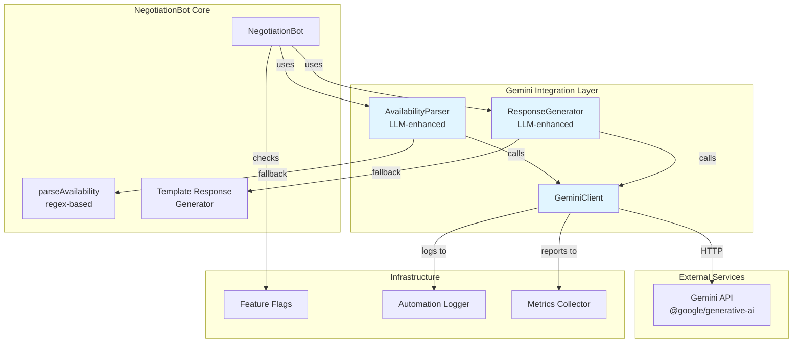
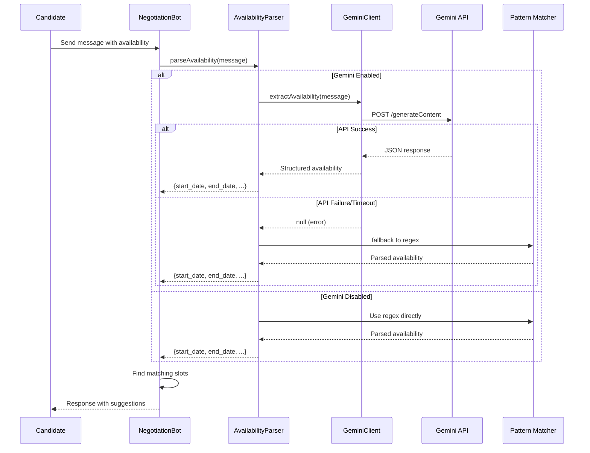
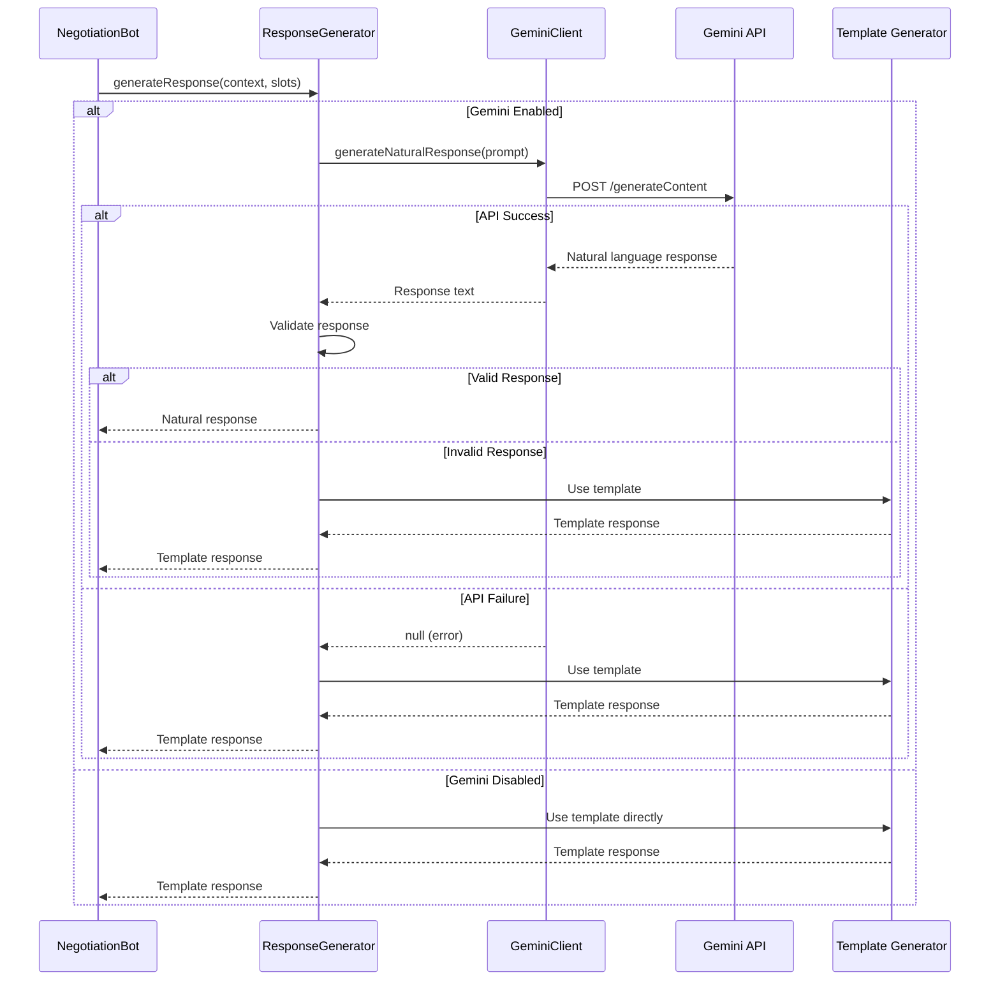
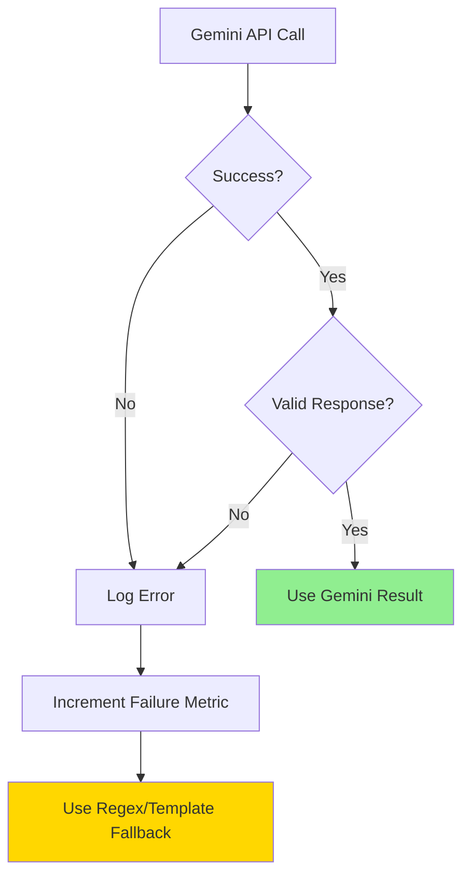

# Design Document: Gemini LLM Negotiation Integration

## Overview

This design integrates Google's Gemini LLM into the existing NegotiationBot to enhance natural language understanding and response generation. The integration maintains backward compatibility through a fallback mechanism that reverts to regex-based parsing when Gemini is unavailable.

The enhancement addresses two critical limitations in the current implementation:

1. **Availability Parsing**: Current regex patterns struggle with natural language variations like "I'm free next Tuesday afternoon" or "How about sometime between 2-4pm on the 15th?"
2. **Response Generation**: Template-based responses lack contextual awareness and conversational flow

The design follows a wrapper pattern where Gemini capabilities augment existing functionality without replacing the core negotiation logic. Feature flags enable gradual rollout and A/B testing.

## Architecture

### High-Level Component Diagram



### Data Flow: Candidate Message Processing



### Data Flow: Response Generation



## Components and Interfaces

### 1. GeminiClient Service

The GeminiClient provides a centralized interface to the Gemini API with error handling, timeout management, and metrics collection.

**File**: `backend/services/GeminiClient.js`

**Responsibilities**:
- Initialize Gemini API client with configuration
- Handle API authentication and rate limiting
- Implement timeout and retry logic
- Log API calls and collect metrics
- Provide type-safe methods for different prompt types

**Interface**:

```javascript
class GeminiClient {
  /**
   * Initialize Gemini client
   * @param {object} config - Configuration object
   * @param {string} config.apiKey - Gemini API key
   * @param {string} config.modelName - Model name (default: gemini-1.5-flash)
   * @param {number} config.timeout - Request timeout in ms (default: 10000)
   * @throws {Error} If API key is missing
   */
  constructor(config)

  /**
   * Extract structured availability from natural language
   * @param {string} message - Candidate message
   * @returns {Promise<object|null>} Parsed availability or null
   * @throws {Error} On API errors (caller should handle)
   */
  async extractAvailability(message)

  /**
   * Generate natural language response
   * @param {object} context - Conversation context
   * @param {Array} context.history - Message history
   * @param {string} context.state - Current negotiation state
   * @param {Array} context.slots - Available slots (optional)
   * @param {number} context.round - Current round number
   * @param {number} context.maxRounds - Maximum rounds
   * @returns {Promise<string|null>} Generated response or null
   * @throws {Error} On API errors (caller should handle)
   */
  async generateResponse(context)

  /**
   * Get client metrics
   * @returns {object} Metrics object
   */
  getMetrics()
}
```

**Configuration**:
- Environment variable: `GEMINI_API_KEY`
- Model name: `GEMINI_MODEL_NAME` (default: "gemini-1.5-flash")
- Timeout: `GEMINI_TIMEOUT_MS` (default: 10000)

**Error Handling**:
- Throws configuration error if API key missing
- Returns null on API failures (caller handles fallback)
- Logs all errors with context
- Implements exponential backoff for rate limits

### 2. Enhanced AvailabilityParser

The AvailabilityParser wraps the existing `parseAvailability` method with Gemini-powered extraction.

**Integration Point**: `NegotiationBot.parseAvailability(message)`

**Implementation Strategy**:

```javascript
// In NegotiationBot.js
parseAvailability(message) {
  // Check if Gemini is enabled
  if (this.geminiClient && await isFeatureEnabled('gemini_parsing')) {
    try {
      const geminiResult = await this.geminiClient.extractAvailability(message);
      
      if (geminiResult) {
        // Log successful Gemini parse
        await this.logGeminiUsage('availability_parsing', true);
        return geminiResult;
      }
    } catch (error) {
      // Log failure and fall through to regex
      console.error('[NegotiationBot] Gemini parsing failed:', error);
      await this.logGeminiUsage('availability_parsing', false);
    }
  }
  
  // Fallback to existing regex-based parsing
  return this.parseAvailabilityRegex(message);
}

// Rename existing method
parseAvailabilityRegex(message) {
  // ... existing regex logic ...
}
```

**Gemini Prompt Design**:

```javascript
const AVAILABILITY_EXTRACTION_PROMPT = `You are a scheduling assistant. Extract availability information from the candidate's message.

Candidate message: "${message}"

Current date: ${new Date().toISOString().split('T')[0]}

Extract the following information:
- start_date: First available date (ISO format)
- end_date: Last available date (ISO format)
- preferred_hours: {start: hour, end: hour} in 24-hour format, or null
- preferred_days: Array of day names (lowercase), or null

Rules:
1. Return ONLY valid JSON, no additional text
2. Use ISO 8601 date format (YYYY-MM-DD)
3. Interpret relative dates (e.g., "next week", "tomorrow") based on current date
4. If no specific dates mentioned, use reasonable defaults (e.g., next 14 days)
5. If information is ambiguous or missing, return null for that field
6. For time expressions like "morning", use {start: 9, end: 12}
7. For "afternoon", use {start: 12, end: 18}
8. For "evening", use {start: 18, end: 21}

Return format:
{
  "start_date": "YYYY-MM-DD",
  "end_date": "YYYY-MM-DD",
  "preferred_hours": {"start": 9, "end": 17} or null,
  "preferred_days": ["monday", "tuesday"] or null
}

If you cannot extract any availability information, return: {"error": "no_availability_found"}`;
```

**Response Validation**:

```javascript
function validateAvailabilityResponse(response) {
  if (!response || typeof response !== 'object') return null;
  
  if (response.error) return null;
  
  // Validate required fields
  if (!response.start_date || !response.end_date) return null;
  
  // Parse and validate dates
  const startDate = new Date(response.start_date);
  const endDate = new Date(response.end_date);
  
  if (isNaN(startDate.getTime()) || isNaN(endDate.getTime())) return null;
  if (startDate > endDate) return null;
  
  // Validate preferred_hours if present
  if (response.preferred_hours) {
    const { start, end } = response.preferred_hours;
    if (typeof start !== 'number' || typeof end !== 'number') return null;
    if (start < 0 || start > 23 || end < 0 || end > 23) return null;
    if (start >= end) return null;
  }
  
  // Validate preferred_days if present
  if (response.preferred_days) {
    if (!Array.isArray(response.preferred_days)) return null;
    const validDays = ['monday', 'tuesday', 'wednesday', 'thursday', 'friday', 'saturday', 'sunday'];
    if (!response.preferred_days.every(day => validDays.includes(day.toLowerCase()))) {
      return null;
    }
  }
  
  return {
    start_date: startDate,
    end_date: endDate,
    preferred_hours: response.preferred_hours || null,
    preferred_days: response.preferred_days || null
  };
}
```

### 3. Enhanced ResponseGenerator

The ResponseGenerator creates natural language responses using Gemini while maintaining the existing template fallback.

**Integration Point**: Multiple locations in `NegotiationBot.processMessage()`

**Implementation Strategy**:

```javascript
// In NegotiationBot.js
async generateResponse(type, context) {
  // Check if Gemini is enabled
  if (this.geminiClient && await isFeatureEnabled('gemini_responses')) {
    try {
      const geminiResponse = await this.geminiClient.generateResponse({
        type,
        ...context
      });
      
      if (geminiResponse && this.validateResponse(geminiResponse)) {
        await this.logGeminiUsage('response_generation', true);
        return geminiResponse;
      }
    } catch (error) {
      console.error('[NegotiationBot] Gemini response generation failed:', error);
      await this.logGeminiUsage('response_generation', false);
    }
  }
  
  // Fallback to template-based response
  return this.generateTemplateResponse(type, context);
}
```

**Response Types and Prompts**:

1. **Slot Suggestions** (when matching slots found):

```javascript
const SLOT_SUGGESTION_PROMPT = `You are a friendly scheduling assistant helping a candidate schedule an interview.

Context:
- Conversation history: ${JSON.stringify(history)}
- Available slots found: ${JSON.stringify(slots)}
- Current round: ${round}

Task: Present the available time slots in a natural, conversational way.

Requirements:
1. Be friendly and professional
2. Present up to 3 slots clearly
3. Ask the candidate to select one or provide alternatives
4. Keep response under 200 words
5. Do NOT make commitments beyond scheduling
6. Do NOT share personal information
7. Format dates and times clearly

Generate a natural response:`;
```

2. **Request Alternative Times** (no matching slots):

```javascript
const REQUEST_ALTERNATIVES_PROMPT = `You are a friendly scheduling assistant helping a candidate schedule an interview.

Context:
- Conversation history: ${JSON.stringify(history)}
- No matching slots found
- Current round: ${round} of ${maxRounds}

Task: Politely explain that the suggested times don't work and ask for alternatives.

Requirements:
1. Be empathetic and understanding
2. Explain that the times don't align with recruiter availability
3. Ask for alternative times
4. Mention this is attempt ${round} of ${maxRounds}
5. Keep response under 200 words
6. Maintain a positive, helpful tone

Generate a natural response:`;
```

3. **Escalation Message** (max rounds exceeded):

```javascript
const ESCALATION_PROMPT = `You are a friendly scheduling assistant helping a candidate schedule an interview.

Context:
- Conversation history: ${JSON.stringify(history)}
- Unable to find matching times after ${maxRounds} attempts
- Escalating to human recruiter

Task: Inform the candidate that a recruiter will contact them directly.

Requirements:
1. Be professional and reassuring
2. Explain that you've notified the recruiter
3. Thank them for their patience
4. Keep response under 200 words
5. Maintain a positive tone

Generate a natural response:`;
```

4. **Clarification Request** (couldn't parse availability):

```javascript
const CLARIFICATION_PROMPT = `You are a friendly scheduling assistant helping a candidate schedule an interview.

Context:
- Conversation history: ${JSON.stringify(history)}
- Unable to understand availability from last message

Task: Politely ask the candidate to provide their availability more clearly.

Requirements:
1. Be friendly and helpful
2. Provide examples of how to express availability
3. Examples: "Monday-Wednesday next week, 2-5 PM" or "12/15 and 12/16 in the afternoon"
4. Keep response under 200 words
5. Don't make the candidate feel they did something wrong

Generate a natural response:`;
```

**Response Validation**:

```javascript
function validateResponse(response) {
  if (!response || typeof response !== 'string') return false;
  
  // Check length constraint
  const wordCount = response.split(/\s+/).length;
  if (wordCount > 250) return false; // Allow some buffer
  
  // Check for inappropriate content patterns
  const inappropriatePatterns = [
    /\b(password|credit card|ssn|social security)\b/i,
    /\b(call me|text me|my number is)\b/i,
    /\b(I promise|I guarantee|I commit)\b/i
  ];
  
  if (inappropriatePatterns.some(pattern => pattern.test(response))) {
    console.warn('[NegotiationBot] Response validation failed: inappropriate content');
    return false;
  }
  
  return true;
}
```

### 4. Feature Flag Integration

**Feature Flags**:
- `gemini_parsing`: Enable Gemini-powered availability parsing
- `gemini_responses`: Enable Gemini-powered response generation
- `gemini_enabled`: Master flag for all Gemini features

**Rollout Strategy**:
```javascript
// Percentage-based rollout
const geminiConfig = {
  gemini_enabled: {
    enabled: true,
    rollout_percentage: 25 // Start with 25% of sessions
  },
  gemini_parsing: {
    enabled: true,
    rollout_percentage: 50 // More aggressive for parsing
  },
  gemini_responses: {
    enabled: true,
    rollout_percentage: 25 // Conservative for responses
  }
};
```

### 5. Monitoring and Metrics

**Metrics to Track**:

```javascript
const geminiMetrics = {
  // API metrics
  api_calls_total: 0,
  api_calls_success: 0,
  api_calls_failure: 0,
  api_response_time_ms: [],
  
  // Parsing metrics
  parsing_attempts: 0,
  parsing_success: 0,
  parsing_fallback: 0,
  
  // Response generation metrics
  response_attempts: 0,
  response_success: 0,
  response_fallback: 0,
  
  // Validation metrics
  validation_failures: 0,
  
  // Business metrics
  negotiation_success_rate_gemini: 0,
  negotiation_success_rate_regex: 0
};
```

**Logging Format**:

```javascript
await automationLogger.log({
  jobId: interview.job_id,
  actionType: 'gemini_api_call',
  triggerSource: 'auto',
  actorId: null,
  details: {
    call_type: 'availability_parsing',
    success: true,
    response_time_ms: 234,
    fallback_used: false,
    session_id: session.id,
    model: 'gemini-1.5-flash'
  }
});
```

## Data Models

### Gemini API Request/Response

**Availability Extraction Request**:
```javascript
{
  contents: [{
    parts: [{
      text: AVAILABILITY_EXTRACTION_PROMPT
    }]
  }],
  generationConfig: {
    temperature: 0.1,  // Low temperature for consistent parsing
    topK: 1,
    topP: 1,
    maxOutputTokens: 256,
    responseMimeType: "application/json"
  }
}
```

**Availability Extraction Response**:
```javascript
{
  start_date: "2024-12-20",
  end_date: "2024-12-27",
  preferred_hours: {
    start: 14,
    end: 17
  },
  preferred_days: ["monday", "wednesday", "friday"]
}
```

**Response Generation Request**:
```javascript
{
  contents: [{
    parts: [{
      text: RESPONSE_GENERATION_PROMPT
    }]
  }],
  generationConfig: {
    temperature: 0.7,  // Higher temperature for natural variation
    topK: 40,
    topP: 0.95,
    maxOutputTokens: 512
  }
}
```

**Response Generation Response**:
```javascript
{
  candidates: [{
    content: {
      parts: [{
        text: "Great! I found some times that work..."
      }]
    }
  }]
}
```

### Enhanced NegotiationBot State

**No schema changes required**. The existing `negotiation_sessions` table supports the integration:

```sql
-- Existing schema (no changes)
CREATE TABLE negotiation_sessions (
  id UUID PRIMARY KEY,
  interview_id UUID REFERENCES interviews(id),
  round INTEGER,
  state TEXT,
  history JSONB,  -- Stores conversation history
  suggested_slots JSONB,
  created_at TIMESTAMP DEFAULT NOW(),
  updated_at TIMESTAMP DEFAULT NOW()
);
```

**History Entry Format** (enhanced with metadata):

```javascript
{
  role: 'bot',
  message: 'Great! I found some times...',
  timestamp: '2024-12-15T10:30:00Z',
  metadata: {
    generated_by: 'gemini',  // or 'template'
    model: 'gemini-1.5-flash',
    response_time_ms: 234
  }
}
```

### Configuration Schema

**Environment Variables**:
```bash
# Gemini API Configuration
GEMINI_API_KEY=your_api_key_here
GEMINI_MODEL_NAME=gemini-1.5-flash
GEMINI_TIMEOUT_MS=10000

# Feature Flags (in database)
# gemini_enabled: true/false
# gemini_parsing: true/false
# gemini_responses: true/false
```

## Security Considerations

### 1. Prompt Injection Protection

**Input Sanitization**:

```javascript
function sanitizeMessage(message) {
  // Remove potential prompt injection patterns
  let sanitized = message;
  
  // Remove system-like instructions
  sanitized = sanitized.replace(/\b(ignore|disregard|forget)\s+(previous|above|all)\s+(instructions|prompts)/gi, '[removed]');
  
  // Remove role-playing attempts
  sanitized = sanitized.replace(/\b(you are now|act as|pretend to be)\b/gi, '[removed]');
  
  // Limit length
  if (sanitized.length > 1000) {
    sanitized = sanitized.substring(0, 1000);
  }
  
  return sanitized;
}
```

**Prompt Structure**:
- Use clear delimiters between instructions and user input
- Explicitly state what the model should NOT do
- Validate outputs against expected schema

### 2. Data Privacy

**PII Handling**:
- Never include candidate email, phone, or personal details in prompts
- Use candidate ID references instead of names when possible
- Log only non-PII metadata

**API Data Retention**:
- Gemini API does not retain data from API calls (per Google's policy)
- Still minimize sensitive data in prompts

### 3. API Key Security

**Storage**:
- Store API key in environment variables only
- Never commit API keys to version control
- Use secret management service in production

**Access Control**:
- Restrict API key access to backend services only
- Rotate keys periodically
- Monitor for unauthorized usage

### 4. Rate Limiting and Abuse Prevention

**Client-Side Rate Limiting**:
```javascript
class RateLimiter {
  constructor(maxRequests, windowMs) {
    this.maxRequests = maxRequests;
    this.windowMs = windowMs;
    this.requests = [];
  }
  
  async checkLimit() {
    const now = Date.now();
    this.requests = this.requests.filter(time => now - time < this.windowMs);
    
    if (this.requests.length >= this.maxRequests) {
      throw new Error('Rate limit exceeded');
    }
    
    this.requests.push(now);
  }
}

// Usage: 60 requests per minute
const rateLimiter = new RateLimiter(60, 60000);
```

### 5. Response Validation

**Content Safety**:
- Validate responses don't contain inappropriate content
- Check for policy violations (commitments, personal info sharing)
- Fallback to templates if validation fails

## Error Handling

### Error Categories and Responses

**1. Configuration Errors**:
```javascript
// Missing API key
if (!process.env.GEMINI_API_KEY) {
  throw new Error('GEMINI_API_KEY environment variable is required');
}
```

**2. API Errors**:
```javascript
try {
  const result = await geminiClient.extractAvailability(message);
} catch (error) {
  if (error.code === 'ETIMEDOUT') {
    console.error('[GeminiClient] Request timeout');
    await metricsCollector.increment('gemini_timeout');
  } else if (error.status === 429) {
    console.error('[GeminiClient] Rate limit exceeded');
    await metricsCollector.increment('gemini_rate_limit');
  } else if (error.status === 401) {
    console.error('[GeminiClient] Authentication failed');
    await metricsCollector.increment('gemini_auth_error');
  } else {
    console.error('[GeminiClient] API error:', error);
    await metricsCollector.increment('gemini_api_error');
  }
  
  // Return null to trigger fallback
  return null;
}
```

**3. Validation Errors**:
```javascript
const parsed = await geminiClient.extractAvailability(message);

if (!validateAvailabilityResponse(parsed)) {
  console.warn('[NegotiationBot] Invalid Gemini response, using fallback');
  await metricsCollector.increment('gemini_validation_failure');
  return this.parseAvailabilityRegex(message);
}
```

**4. Timeout Handling**:
```javascript
const timeout = (ms) => new Promise((_, reject) => 
  setTimeout(() => reject(new Error('Timeout')), ms)
);

try {
  const result = await Promise.race([
    geminiClient.extractAvailability(message),
    timeout(10000)
  ]);
} catch (error) {
  if (error.message === 'Timeout') {
    console.error('[GeminiClient] Request timeout after 10s');
    return null; // Trigger fallback
  }
  throw error;
}
```

### Fallback Decision Tree



### Error Logging

**Log Levels**:
- ERROR: API failures, authentication issues
- WARN: Validation failures, fallback activation
- INFO: Successful API calls, metrics

**Log Format**:
```javascript
{
  timestamp: '2024-12-15T10:30:00Z',
  level: 'ERROR',
  component: 'GeminiClient',
  action: 'extractAvailability',
  error: {
    message: 'API request failed',
    code: 'ECONNREFUSED',
    status: null
  },
  context: {
    session_id: 'uuid',
    interview_id: 'uuid',
    fallback_used: true
  }
}
```

